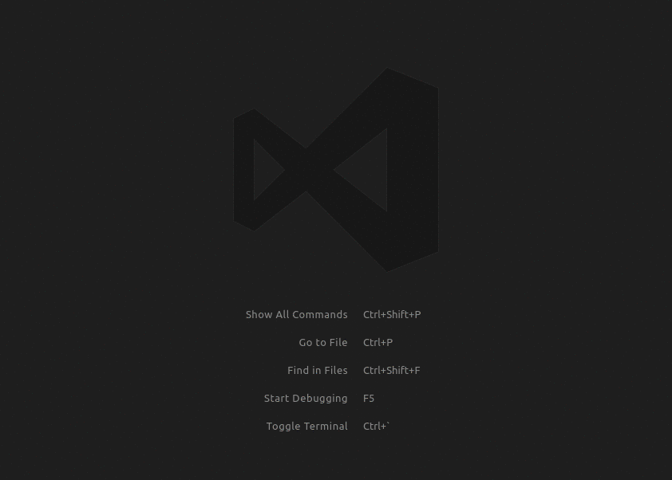
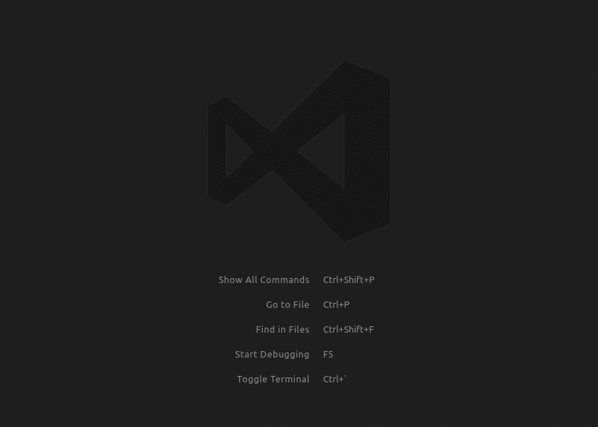

# Laravel Artisan

Run Laravel Artisan commands from within Visual Studio Code.

## Features

* Make files
* Manage the database
* Clear Caches
* Generate Keys

### Get a list of routes

### Make a controller

## Requirements

* A useable version of `php` that can be ran on the commandline such as `php-cli` (This should be in your path)
    * The following command should yeild the a php version:
    * `php -v`
        * If no php version is returned you don't have php setup correctly.
        * If you get a version back you are good to go!
* A Laravel install that has `artisan` in the workspace root
    * cd into your root directory and run the following command:
    * `php artisan -v`
        * If an error is returned you don't have laravel setup correctly.
        * If you get a Laravel version and a list of commands you are good to go!

## Known Issues

* Currently custom commands can not be ran, but they can be created.
* Not all commands are implemented (but most are), as they will be added later on.

## How to use

Once you have installed the extension, you can open the command pallet, and start running the commands. Just type `Artisan:` to get a list of commands.

Many commands have optional input questions, leave them blank to use the defaults, or enter your own value.

## Enjoy
